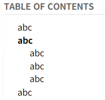

Mark font red  of the position being browsed in the Table of contents.
## version: 0.2
## Installation
Create a code note of type JS Frontend with the contents of trilium-show-position-in-toc.js and the label #widget
## Features
1. Refresh when the mouse moves or scrolls
2. According to the area of the mouse, mark the browse position in red in Table of contents
3. Auto scroll Table of contents
## Preview
